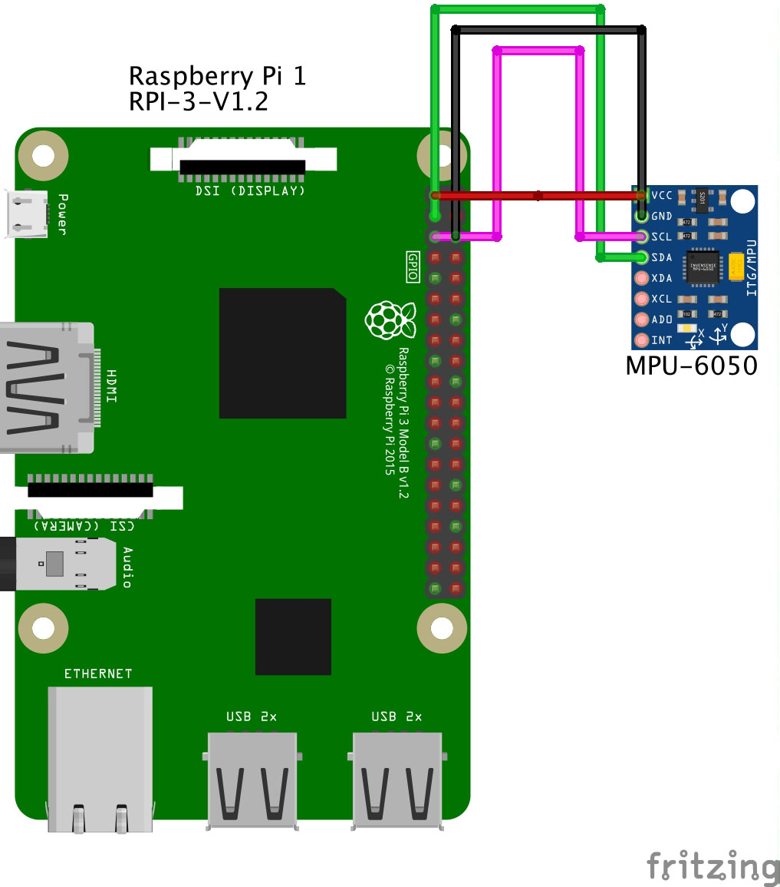
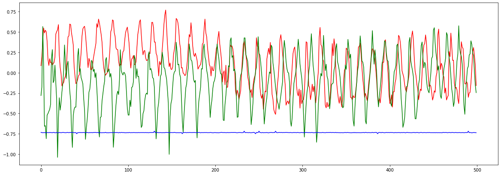
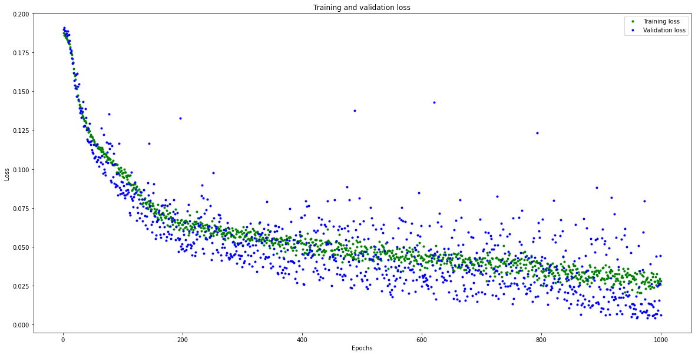
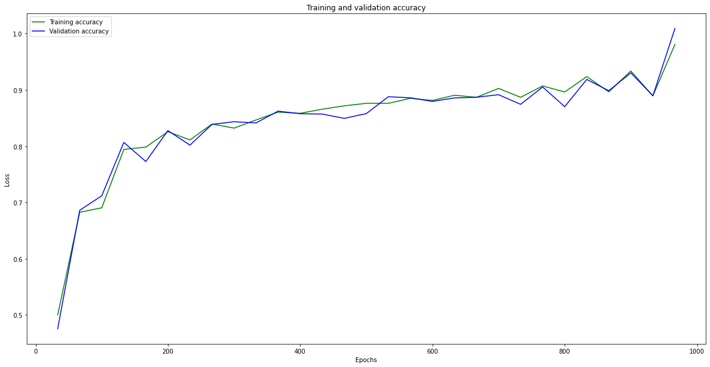
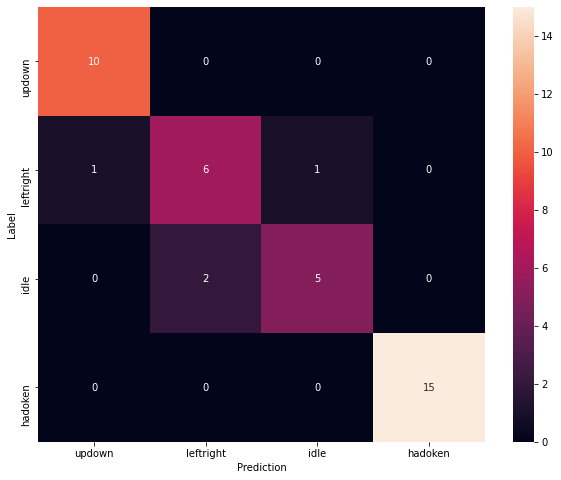
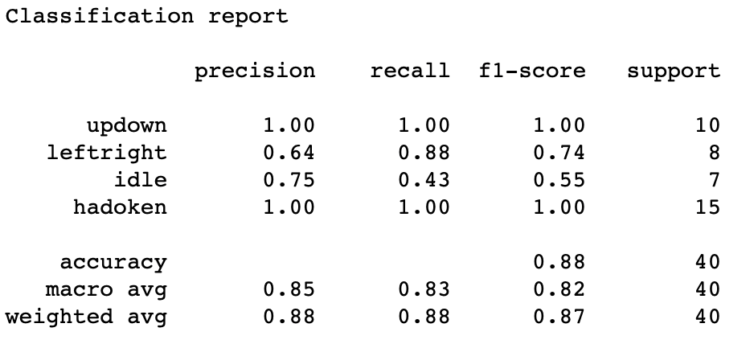

Gesture recognition is a fascinating area widely explored in the literature. Mainly used in Human-Computer Interaction (HCI), its goal is to infer users’ actions based on their movement. The general structure of our project for detecting gestures consists of three main steps:
- **Data acquisition**. In the first step, we list all the mechanisms used for collecting movements data and saving it in a usable shape.
- **Data processing**. This step includes cleaning, data analysis, and model training.
- **Interpretation**. In the last step, we can judge whether our trained model works well or whether we totally messed up :-(
In this article, we will build a simple model that collects data from Inertial Measurement Unit (IMU) sensors and identifies known gestures. The rest of the article is specially dedicated to those of you born in the ’90s and/or who have a culture of arcade gaming. If it applies to you, then you probably heard about *Street Fighter II*. If words like *SNES*, *Street Fighter* or *arcade* sound unfamiliar to you, please read [this article](https://en.wikipedia.org/wiki/Street_Fighter_II).

## Data acquisition
To collect data, we can use two approaches. The first one using a 3-Axis accelerometer and gyroscope IMU - ***MPU6050***  and the second approach using a ***Nordic Thingy:52*** which is built on a Bluetooth 5 ready ***nRF52832 SoC*** and embeds a 9-axis IMU (Accelerometer, compass and Gyroscope).

### Collecting data with an MPU6050
If you choose to use this approach, make sure to order the correct IMU sensor. You can use this link as a reference: [MPU-6050 on Amazon](https://www.amazon.com/HiLetgo-MPU-6050-Accelerometer-Gyroscope-Converter/dp/B00LP25V1A/ref=sr_1_1?dchild=1&keywords=MPU-6050&qid=1625759114&sr=8-1).
As you can see, it is pretty cheap. Do not hesitate to order several items just to be on the safe side. In this article, we will collect data from the IMU sensor through a Raspberry Pi. Make sure to have a soldering iron and some wires to connect to the GPIO port on your Raspberry, as presented below.
<figure>
	
	<figcaption>Wiring an MPU6050 to RPi GPIO ports</figcaption>
</figure>

Once the hardware part is done, we can focus on the software side. To manipulate the data, we will create a simple script to link the sensor to the Raspberry, collect the data and store in a file.

```python
from board import SDA, SCL
from imu_mpu6050 import MPU6050
import busio
import time
import csv

i2c = busio.I2C(SCL, SDA)
IMU=MPU6050(i2c)
print(IMU.whoami)

data = []
SAMPLES = 500
  
while(len(data)<SAMPLES):
    acc =IMU.get_accel_data(g=True)
    gyro = IMU.get_gyro_data()
    tmp_dict = {"acc_x":acc["x"], "acc_y":acc["y"], "acc_z":acc["z"], "gyro_x":gyro["x"], "gyro_y":gyro["y"], "gyro_z":gyro["z"] }
    data.append(tmp_dict)
    print(str(len(data)/SAMPLES*100)+"%")
    time.sleep(0.1)
    
    
with open("idle.csv", mode="w") as f:
    w = csv.DictWriter(f, data[0].keys())
    w.writeheader()
    for i in data:
        w.writerow(i)

```

The data collected will be used to train our Neural Network. By default, we will collect 10 samples per second or each action and save them in a `CSV` file that should look like this:
```csv
acc_x,acc_y,acc_z,gyro_x,gyro_y,gyro_z
0.414794921875,-0.2760009765625,0.800048828125,-2.450381679389313,15.49618320610687,0.2366412213740458
0.4761962890625,-0.241943359375,0.863037109375,-0.08396946564885496,25.427480916030536,-5.419847328244275
0.5587158203125,-0.453125,0.8902587890625,9.969465648854962,18.244274809160306,37.36641221374046
0.731201171875,-0.578125,0.932373046875,22.557251908396946,45.74809160305343,85.35114503816794
```

The gestures we will try to detect are:
- **leftright**. The action of moving a hand (while holding the sensor) from left to right repeatedly.
- **updown**. Same as the previous but we should move from up to down repeatedly.
- **Hadoken**. The coolest part of this project. We just have to make (a lot of) hadokens.
- **Idle**. We will just collect data on a flat surface. For our example, we will consider unknown actions as idle.

Collecting data is annoying; that is why I am sharing with you all the data you will need: [leftright](https://raw.githubusercontent.com/alphasldiallo/IMU_data/main/leftright.csv), [updown](https://raw.githubusercontent.com/alphasldiallo/IMU_data/main/updown.csv), [hadoken](https://raw.githubusercontent.com/alphasldiallo/IMU_data/main/hadoken.csv), [idle](https://raw.githubusercontent.com/alphasldiallo/IMU_data/main/idle.csv).

### Collecting data using a Thingy:52

To collect data from the Thingy:52, we can use this nice open-source library available here: https://github.com/hbldh/bleak. To get the measurements, we will first make a scan to get our device's UUID: 
```python
import asyncio
from bleak import BleakScanner


async def run():
    devices = await BleakScanner.discover()
    for d in devices:
        if "Thingy" in d.name:
            print(d)

loop = asyncio.get_event_loop()
loop.run_until_complete(run())
```
**Hint**: Make sure to install the dependencies before running the scripts.

If everything goes as expected, we should get a list containing all the Thingys in the surroundings. In my case, I only have one with the following UUID: `3F706B28-2A00-4C26-9C1F-AF1C2F01299B`.

With the Thingy, we will collect data from the accelerometer and save it in a CSV file. We use the following script to collect the acceleration data as notifications from the Thingy.

```python

"""
More details: https://github.com/hbldh/bleak
"""

import logging
import asyncio
import platform
import os
import sys

from bleak import BleakClient, _logger as logger
from struct import unpack

QUATERNION_CHAR = "ef680404-9b35-4933-9b10-52ffa9740042" # <---- Characteristic we are interested in to get data from the IMU sensor.


def notification_handler(sender, data):
    # TODO: Write data in a CSV file
    # TODO: Send the data to the central server
    """Simple notification handler which prints the data received."""
    print("x:\t{0} \t\t y:\t{1} \t\t z:\t{2}".format(float(unpack('i', data[4:8])[0]) / (1 << 30),
                                                     float(unpack('i', data[8:12])[0]) / (1 << 30),
                                                     float(unpack('i', data[12:])[0]) / (1 << 30)))


async def run(address, debug=True):
    if debug:
        l = logging.getLogger("asyncio")
        l.setLevel(logging.DEBUG)
        h = logging.StreamHandler(sys.stdout)
        h.setLevel(logging.DEBUG)
        l.addHandler(h)
        logger.addHandler(h)

    async with BleakClient(address) as client:
        logger.info(f"Connected: {client.is_connected}")

        await client.start_notify(QUATERNION_CHAR, notification_handler)
        await asyncio.sleep(100.0)
        await client.stop_notify(QUATERNION_CHAR)


if __name__ == "__main__":
    os.environ["PYTHONASYNCIODEBUG"] = str(1)
    address = (
        "24:71:89:cc:09:05"  # <--- Change to your device's address here if you are using Windows or Linux
        if platform.system() != "Darwin"
        else "3F706B28-2A00-4C26-9C1F-AF1C2F01299B"  # <--- Change to your device's address here if you are using macOS
    )
    loop = asyncio.get_event_loop()
    loop.run_until_complete(run(address, True))

```

## Preprocessing

In this section, we will manipulate the collected data and try to have a better understanding of the datasets. The libraries that will be use are: `pandas`, `numpy`, `matplotlib`, `scikit-learn` and `tensorflow`.
```python
import pandas as pd
import numpy as np
import matplotlib.pyplot as plt
import sklearn as sk
import tensorflow as tf
```

We will convert our datasets into Panda's dataframes and plot some values:
```python
# Here, we create the dataframes
df1 = pd.read_csv("./updown.csv")
df2 = pd.read_csv("./leftright.csv")
df3 = pd.read_csv("./hadoken.csv")
df4 = pd.read_csv("./idle.csv")

fig = plt.figure(figsize=(20, 7))
ax = plt.axes()

# And we plot some of the data from the accelerometer
plt.plot(df1["acc_x"], "r")
plt.plot(df2["acc_x"], "g")
plt.plot(df4["acc_x"], "b")
plt.show()
```
The plot below shows the acceleration on the *x axis* of dataframes 1, 2, and 4 (respectively `updown`, `leftright` and `idle`). For a human, it is difficult to distinguish the acceleration on the *x axis* when we move `updown` and `leftright`. Data collected from `idle` are clearly distinguishable as the device stays idle on a flat surface.

<figure>

	<figcaption>Acceleration on the x axis from updown, leftright and idle</figcaption>
</figure>

For the moment, our data is still messy and hard to manipulate. To clean it up, we will proceed with two steps: ***encoding*** and ***normalization***.
As our output data are categorical, we will use an encoding technique to turn the output into numerical values. We will turn the categories into vectors of binaries values, each bit will represent a possible category. This method is called [One-hot encoding](https://en.wikipedia.org/wiki/One-hot). 

```python
# Encoding

# list of possible gestures 
GESTURES = [
    "updown",
    "leftright",
    "idle",
    "hadoken"
]

NUM_GESTURES = len(GESTURES)

# create a one-hot encoded matrix that is used in the output
ONE_HOT_ENCODED_GESTURES = np.eye(NUM_GESTURES)
print(ONE_HOT_ENCODED_GESTURES)

# 
```
To use the data in a given interval, we have to proceed with normalization. Once the data is encoded and normalized, we will save the results in [tensors](https://www.tensorflow.org/guide/tensor) which can be simply seen as multidimensional arrays used by *Tensorflow*. 
```python
# To have meaningful results, we split our timeseries into smaller pieces which should  represent approximately the pattern of a single gesture.
SAMPLES_PER_GESTURE = 10

inputs = []
outputs = []
dfs = [df1, df2, df3, df4]

# read each csv file and push an input and output
for gesture_index in range(NUM_GESTURES):
  gesture = GESTURES[gesture_index]
  print(f"Processing index {gesture_index} for gesture '{gesture}'.")
  
  output = ONE_HOT_ENCODED_GESTURES[gesture_index]
  
  df = dfs[gesture_index]

  # We remove empty value lines from the datasets to avoid having NaN inputs
  df = df.dropna()
  df = df.reset_index(drop=True)
  
  # calculate the number of gesture recordings in the file
  num_recordings = int(df.shape[0] / SAMPLES_PER_GESTURE)
    
  print(f"\tThere are {num_recordings} recordings of the {gesture} gesture.")
  
  for i in range(num_recordings):
    tensor = []
    for j in range(SAMPLES_PER_GESTURE):
      index = i * SAMPLES_PER_GESTURE + j
      # normalize the input data, between 0 to 1:
      # - acceleration is between: -4 to +4
      # - gyroscope is between: -2000 to +2000
      tensor += [
          (df['acc_x'][index] + 4) / 8,
          (df['acc_y'][index] + 4) / 8,
          (df['acc_z'][index] + 4) / 8,
          (df['gyro_x'][index] + 2000) / 4000,
          (df['gyro_y'][index] + 2000) / 4000,
          (df['gyro_z'][index] + 2000) / 4000
      ]
    inputs.append(tensor)
    outputs.append(output)

# convert the list to numpy array
inputs = np.array(inputs)
outputs = np.array(outputs)

```

## Cross-validation
Now that we have cleaned and normalized data, we can employ a common technique used in Machine Learning. This method is called ***cross-validation*** and it is used to evaluate a model on data samples. The first step is to randomize the original data samples by swapping the indexes of both the inputs and the outputs. The next step consists in splitting the randomized data in three separate sets (training, testing and validation) using a ***k-fold cross-validation*** . We will use 60% of the data for the Training set, 20% for the Testing set and 20% for the Validation.
```python
# Let's split the dataset

# Randomize the order of the inputs, so they can be evenly distributed for training and testing
num_inputs = len(inputs)
randomize = np.arange(num_inputs)
np.random.shuffle(randomize)

# Swap the consecutive indexes (0, 1, 2, etc) with the randomized indexes
inputs = inputs[randomize]
outputs = outputs[randomize]

# Split the recordings (group of samples) into three sets: training, testing and validation
TRAIN_SPLIT = int(0.6 * num_inputs)
TEST_SPLIT = int(0.2 * num_inputs + TRAIN_SPLIT)

inputs_train, inputs_test, inputs_validate = np.split(inputs, [TRAIN_SPLIT, TEST_SPLIT])
outputs_train, outputs_test, outputs_validate = np.split(outputs, [TRAIN_SPLIT, TEST_SPLIT])
```

## Building the model
The final step before observing some results is setting up the model. To train our model, we will use a *Keras sequential model* with fully connected stack of layers. For the first and second layers, we will use a *Rectified Linear Unit (ReLU)* as Activation function and *Softmax* for the final layer. The metrics we are interested in are the `Mean Squared Error (MSE)` and the `Accuracy`.
```python
# Build and train

# build the model and train it
model = tf.keras.Sequential()
model.add(tf.keras.layers.Dense(30, activation='relu')) # relu is used for performance
model.add(tf.keras.layers.Dense(15, activation='relu'))
# the final layer is softmax because we only expect one gesture to occur per input
model.add(tf.keras.layers.Dense(NUM_GESTURES, activation='softmax'))
model.compile(optimizer='rmsprop', loss='mse', metrics=['mse', 'accuracy'])
```
Once the model is ready, we can start the training and store the results in a variable called `history`.
```python
history = model.fit(inputs_train, outputs_train, epochs=1000, batch_size=1, validation_data=(inputs_validate, outputs_validate))
```
As you can see, we are training our model in 1000 epochs and with only one sample per gradient update represented by the `batch_size` attribute, feel free to change these parameters.

You can run the script to train the model. Grap a coffee and wait, it usually takes some time.
## Interpretation
If everything goes as planned, we should be able to see how the model performs by manipulating the `History` object returned by `model.fit`.
To plot the loss, we can use the following script:
```python
# increase the size of the graphs. The default size is (6,4).
plt.rcParams["figure.figsize"] = (20,10)

# Our model uses "mean squared error" as the loss function
loss = history.history['loss']
val_loss = history.history['val_loss']
epochs = range(1, len(loss) + 1)
plt.plot(epochs, loss, 'g.', label='Training loss')
plt.plot(epochs, val_loss, 'b.', label='Validation loss')
plt.title('Training and validation loss')
plt.xlabel('Epochs')
plt.ylabel('Loss')
plt.legend()
plt.show()
```
As we can observed from the graph below, the error gradually decreases with the number of epochs and stabilizes at some point. However, we have to be careful not to misinterpret the results; **a loss that is too low or at 0 could indicate that the model overfits**.

<figure>

	<figcaption>Training and validation loss</figcaption>
</figure>
We can also observe that the model quickly converges but shows a scattered loss on the validation set. As the loss decreases, the accuracy increases, as shown in the plot below.

<figure>

	<figcaption>Accuracy of the model on the Training and Validation sets</figcaption>
</figure>

Another way to assess the performance of our model is by using a [confusion matrix](https://en.wikipedia.org/wiki/Confusion_matrix). It is a type of contingency table frequently used to assess the performance of a classification task. For our task, we will have a 4x4 matrix containing our output labels (gestures). On the `x axis`, we have predicted classes and on the `y axis`, we have the actual classes.

<figure>

	<figcaption>Confusion matrix</figcaption>
</figure>

We can observe that our model performs well in detecting some gestures such as `updown` and `hadoken`. For `leftRight`, we observe 6 *True Positives* and 2 *False Positives*. For Idle, we have 5 *True Positives* and 2 *False Positives*. 
To have a better understanding of the performance of our classifier, we can use the *Precision*, *Recall* and *F1-Score* computed as follows:<br>
$$Precision = TP/(TP+FP)\\$$<br>
$$Recall = TP/(TP+FN)\\$$<br>
$$F1-Score =2*\frac{Precision * Recall}{Precision + Recall}$$<br>

You can find below a more detailed classification report generated by `sklearn`:
<figure>

	<figcaption>Classification report</figcaption>
</figure>

We have come to the end of this article, which goal was to explore some important steps in Machine Learning such as data collection, analysis and design stages of a classification model. In a next article, I will show you how to exploit this trained model to perform basic actions in a fighting game using an MPU6050 and a Nordic Thingy:52 microcontroller.

The source code for the project can be found on (Github)[https://github.com/alphasldiallo/IMU_data]. In case you find errors or want to suggest some improvements, do not hesitate to open an issue or make a Pull Request.
